<h1 align="center">Copilot for Obsidian</h1>

<h1 align="center">Obsidian的Copilot插件</h1>

<h2 align="center">
The Ultimate AI Assistant for Your Second Brain
</h2>

<h2 align="center">
您第二大脑的终极AI助手
</h2>

  
  

  <a href="https://www.obsidiancopilot.com/en/docs">Documentation</a> |
  <a href="https://www.youtube.com/@loganhallucinates">Youtube</a> |
  <a href="https://github.com/logancyang/obsidian-copilot/issues/new?template=bug_report.md">Report Bug</a> |
  <a href="https://github.com/logancyang/obsidian-copilot/issues/new?template=feature_request.md">Request Feature</a>

  

Copilot for Obsidian is your best in‑vault AI assistant, designed to listen, act at the speed of thought, and keep you creating in flow—all within Obsidian’s integrated, tab‑free workspace.

Obsidian的Copilot是您保险库中最佳的AI助手，旨在倾听您的想法，以思维的速度行动，并让您在Obsidian集成的无标签页工作区中保持创作流畅。

- **🔒 Your data is 100% yours**: Local storage, no ads, and full control of your API keys.
- **🔒 您的数据100%属于您**：本地存储，无广告，完全控制您的API密钥。

- **🧠 Elevate your second brain**: Tap any OpenAI-compatible or local model to uncover insights, spark connections, and create powerful content.
- **🧠 提升您的第二大脑**：使用任何与OpenAI兼容或本地模型来发现洞察，激发连接，并创建强大的内容。

- **🌐 Instant multimedia understanding**: Drop in webpages, YouTube videos, images, PDFs, or real-time web search for quick insights and summaries.
- **🌐 即时多媒体理解**：拖入网页、YouTube视频、图像、PDF或实时网络搜索，快速获取洞察和摘要。

- **✍️ Create at the speed of thought**: Launch Prompt Palette or edit with AI in one click—your ideas, amplified effortlessly.
- **✍️ 以思维的速度创作**：一键启动提示调色板或使用AI编辑——您的想法，轻松放大。

  <em>Your AI assistant in Obsidian—powerful yet intuitive, keeping you in the creative flow.</em>

  <em>您在Obsidian中的AI助手——功能强大且直观，让您保持创作流畅。</em>

  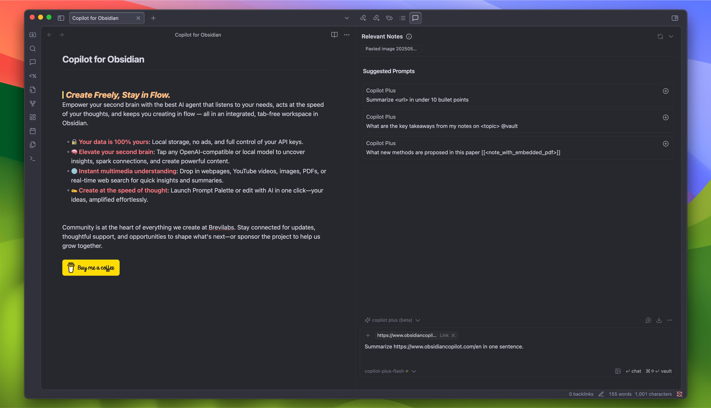

## Why People Love It ❤️

## 为什么人们喜爱它 ❤️

- *"Copilot is the missing link that turns Obsidian into a true second brain. I use it to draft investment memos with text, code, and visuals—all in one place. It’s the first tool that truly unifies how I search, process, organize, and retrieve knowledge without ever leaving Obsidian. With AI-powered search, organization, and reasoning built into my notes, it unlocks insights I’d otherwise miss. My workflow is faster, deeper, and more connected than ever—I can’t imagine working without it."* - @jasonzhangb, Investor & Research Analyst
- *"Copilot是将Obsidian转变为真正第二大脑的缺失环节。我用它来起草包含文本、代码和视觉的投资备忘录——全在一个地方。这是第一个真正统一我搜索、处理、组织和检索知识的方式而不必离开Obsidian的工具。通过AI驱动的搜索、组织和推理内建在我的笔记中，它解锁了我否则会错过的洞察。我的工作流程比以往任何时候都更快、更深入、更连贯——我无法想象没有它的工作。"* - @jasonzhangb, 投资者和研究分析师

- *"Since discovering Copilot, my writing process has been completely transformed. Conversing with my own articles and thoughts is the most refreshing experience I’ve had in decades.”* - Mat QV, Writer
- *"自从发现Copilot以来，我的写作过程完全改变了。与我自己的文章和想法对话是我几十年来最清新的体验。"* - Mat QV, 作家

- *"Copilot has transformed our family—not just as a productivity assistant, but as a therapist. I introduced it to my non‑technical wife, Mania, who was stressed about our daughter’s upcoming exam; within an hour, she gained clarity on her mindset and next steps, finding calm and confidence."* - @screenfluent, A Loving Husband
- *"Copilot改变了我们的家庭——不仅仅是一个生产力助手，更是一位治疗师。我把它介绍给我那位非技术背景的妻子Mania，她对我们女儿即将到来的考试感到压力；在一个小时内，她对自己的心态和下一步行动有了清晰的认识，找到了平静和信心。"* - @screenfluent, 一位充满爱意的丈夫

## **Get Started in 5 Minutes**

## **5分钟快速入门**

### FREE Product Features

### 免费产品功能

**🔌 Install Copilot in Community Plugins in Obsidian**

**🔌 在Obsidian的社区插件中安装Copilot**

**🔑 Set Up Your AI Model (API Key)**

**🔑 设置您的AI模型（API密钥）**

- To start using Copilot AI features, you'll need access to an AI model of your choice.
- 要开始使用Copilot AI功能，您需要访问您选择的AI模型。

  <a href="https://www.youtube.com/watch?v=mzMbiamzOqM" target="_blank">
    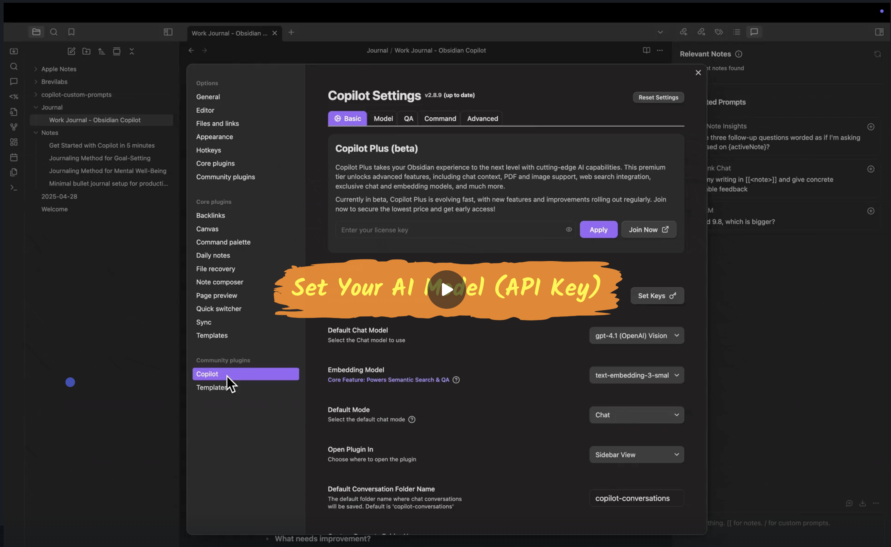
  </a> 
  <em>Click the image to watch the video on YouTube</em>

  <em>点击图片在YouTube上观看视频</em>

**📖** **Chat Mode: Summarize Specific Notes**

**📖** **聊天模式：总结特定笔记**

- 🧠 **Use When:** You want to reference specific notes or folders, generate content, or talk through ideas with Copilot like a knowledgeable thought partner.
- 🧠 **使用场景：** 当您想要引用特定笔记或文件夹、生成内容，或与Copilot像知识渊博的思维伙伴一样讨论想法时。

- 💭 **In [Chat](file://d:\Project\AILearningAssistant\obsidian-copilot\src\components\Chat.tsx#L51-L811) mode, ask Copilot:**
  > _"Summarize [[Meeting Notes – March]] and create a follow-up task list based on notes in {projects}."_
- 💭 **在`聊天`模式中，询问Copilot：**
  > _"总结[[会议记录–三月]]并根据{projects}中的笔记创建后续任务列表。"_

  <a href="https://www.youtube.com/watch?v=idit7nCqEs0" target="_blank">
    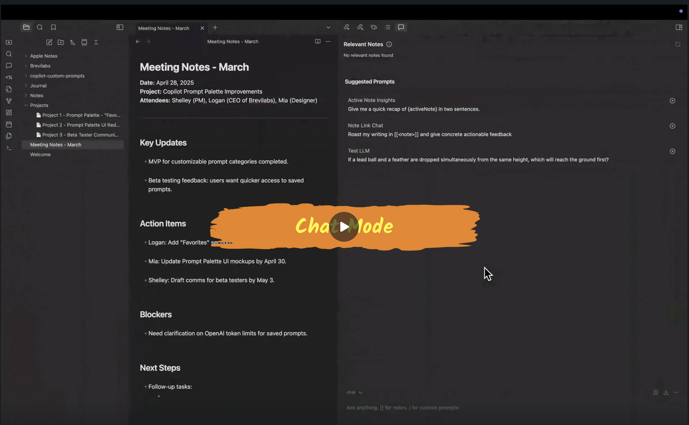
  </a> 
  <em>Click the image to watch the video on YouTube</em>

  <em>点击图片在YouTube上观看视频</em>

**📖** **Vault QA Mode: Chat With Your Entire Vault**

**📖** **保险库问答模式：与您的整个保险库对话**

- 🧠 **Use When:** You want to search your vault for patterns, ideas, or facts without knowing exactly where the information is stored.
- 🧠 **使用场景：** 当您想要在保险库中搜索模式、想法或事实，而不知道信息确切存储位置时。

- 💭 **In `Vault QA` mode, ask Copilot:**
  > _"What insights can I gather about the benefits of journaling from all of my notes?"_
- 💭 **在`保险库问答`模式中，询问Copilot：**
  > _"我能从所有笔记中收集到关于写日记好处的哪些洞察？"_

- 💡 **Tip:** Replace _the benefits of journaling_ with any topic mentioned in your notes to get more precise results.
- 💡 **提示：** 将_写日记的好处_替换为您笔记中提到的任何主题，以获得更精确的结果。

  <a href="https://www.youtube.com/watch?v=hBLMWE8WRFU" target="_blank">
    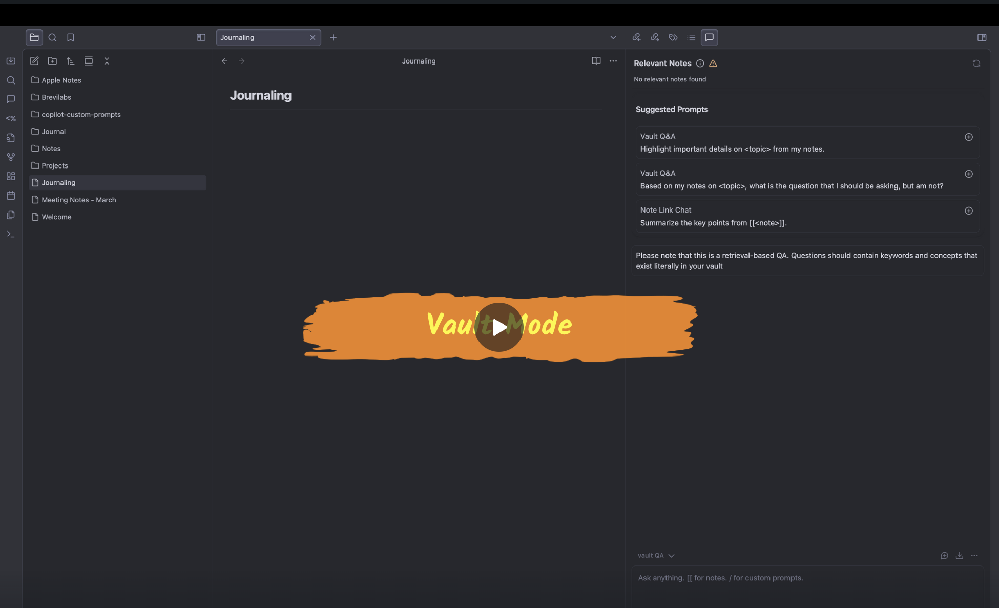
  </a> 
  <em>Click the image to watch the video on YouTube</em>

  <em>点击图片在YouTube上观看视频</em>

**📖 Edit and Apply with One Click**

**📖 一键编辑和应用**

- 🧠 **Use When:** You want to quickly fix grammar, spelling or wording directly in your notes—without switching tabs or manually rewriting.
- 🧠 **使用场景：** 当您想要直接在笔记中快速修正语法、拼写或措辞——而无需切换标签页或手动重写时。

- 💭 **Select the text** and **edit with one RIGHT click**
- 💭 **选择文本**并**右键一键编辑**

- 💡 **Tip:** Set up and customize your right-click menu with common actions you use often, like _"Summarize"_, _"Simplify Language"_, or _"Translate to Formal Tone"_—so you can apply them effortlessly while you write.
- 💡 **提示：** 设置和自定义您的右键菜单，添加您经常使用的常见操作，如_"总结"_、_"简化语言"_或_"翻译为正式语气"_——这样您可以在写作时轻松应用它们。

  <a href="https://www.youtube.com/watch?v=hSmRnmEVoec" target="_blank">
    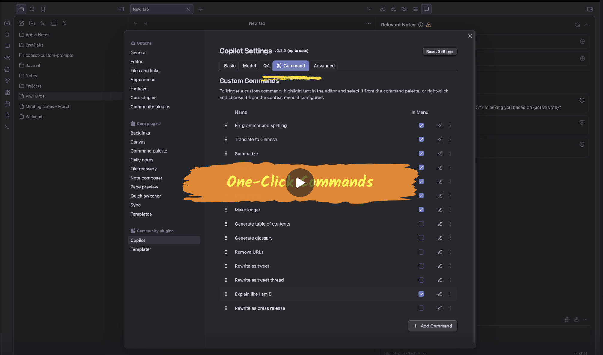
  </a> 
  <em>Click the image to watch the video on YouTube</em>

  <em>点击图片在YouTube上观看视频</em>

**📖 Automate your workflow with the Copilot Prompt Palette**

**📖 使用Copilot提示调色板自动化您的工作流程**

- 🧠 **Use When:** You want to speed up repetitive tasks like summarizing, rewriting, or translating without typing full prompts every time.
- 🧠 **使用场景：** 当您想要加快重复性任务，如总结、重写或翻译，而无需每次都输入完整提示时。

- 💭 Type / to use Prompt Palette
- 💭 输入 / 使用提示调色板

- 💡 **Tip:** Create shortcuts for your most-used actions—like _"Translate to Spanish"_ or _"Draft a blog post outline"_—and trigger them instantly with typing / !
- 💡 **提示：** 为您最常用的操作创建快捷方式——如_"翻译成西班牙语"_或_"起草博客文章大纲"_——并通过输入 / 立即触发它们！

  <a href="https://www.youtube.com/watch?v=9YzY2OJ54wM" target="_blank">
    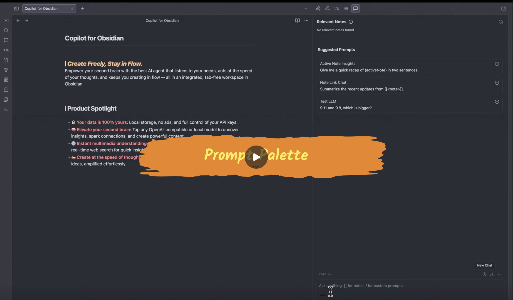
  </a> 
  <em>Click the image to watch the video on YouTube</em>

  <em>点击图片在YouTube上观看视频</em>

**📖 Stay in flow with the Relevant Notes**

**📖 通过相关笔记保持流畅**

- 🧠 **Use When:** You're working on a note and want to pull in context or insights from related notes—without breaking your focus.
- 🧠 **使用场景：** 当您正在处理一个笔记，并希望从相关笔记中引入上下文或洞察——而不会打断您的专注时。

- 💭 Appears automatically when there's useful related content.
- 💭 当有有用的关联内容时自动出现。

- 💡 **Tip:** Use it to quickly reference past research, ideas, or decisions—no need to search or switch tabs.
- 💡 **提示：** 使用它来快速参考过去的研究、想法或决策——无需搜索或切换标签页。

  <a href="https://www.youtube.com/watch?v=qapQD7jD3Uk" target="_blank">
    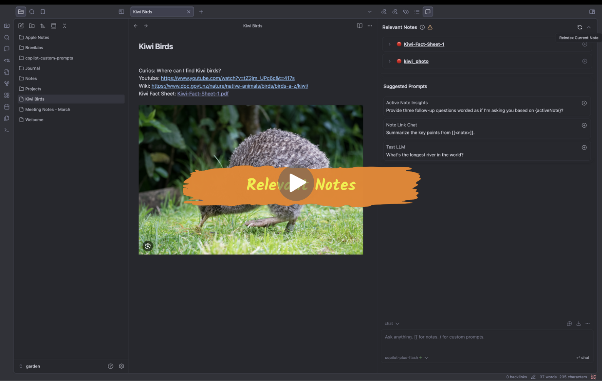
  </a> 
  <em>Click the image to watch the video on YouTube</em>

  <em>点击图片在YouTube上观看视频</em>

### Level Up with Copilot Plus and Beyond

### 通过Copilot Plus及更高版本升级

Copilot Plus brings powerful AI agentic capabilities, context-aware actions and seamless tool integration—built to elevate your knowledge work in Obsidian.

Copilot Plus带来了强大的AI代理功能、情境感知操作和无缝工具集成——专为提升您在Obsidian中的知识工作而构建。

🆙 **Upgrade to Copilot Plus**

🆙 **升级到Copilot Plus**

First, go to https://www.obsidiancopilot.com/en to subscribe to Copilot Plus. Then, set up Copilot Plus License Key in Obsidian.

首先，访问 https://www.obsidiancopilot.com/en 订阅Copilot Plus。然后，在Obsidian中设置Copilot Plus许可证密钥。

  <a href="https://www.youtube.com/watch?v=pPfWKZnNYhA" target="_blank">
    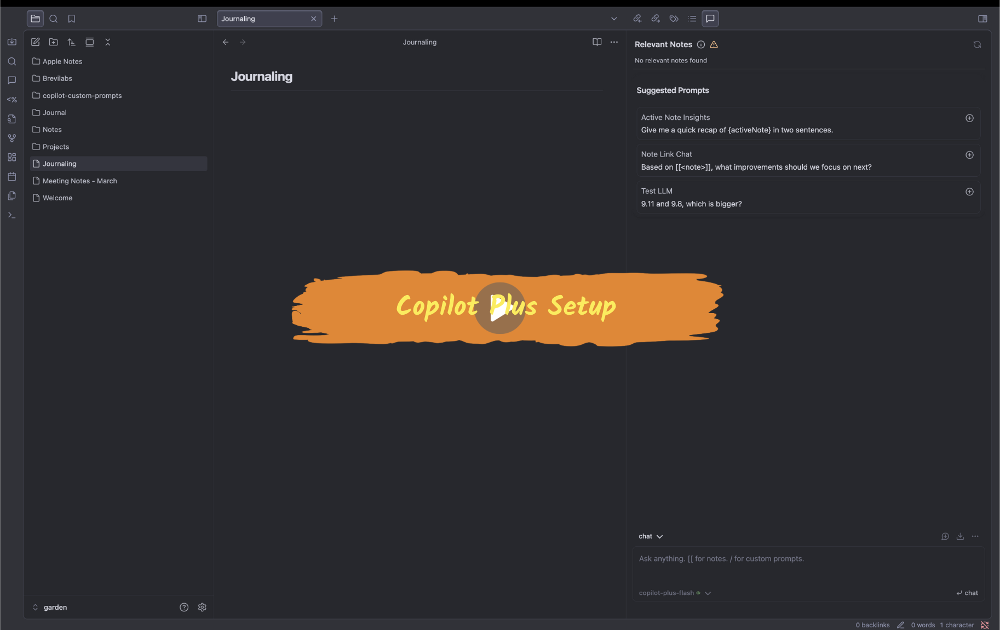
  </a> 
  <em>Click the image to watch the video on YouTube</em>

  <em>点击图片在YouTube上观看视频</em>

❔Community is at the heart of everything we build. Join us on Discord for updates, priority support, and a voice in shaping the best AI products for your experience.

❔社区是我们构建一切的核心。加入我们的Discord获取更新、优先支持，并在塑造最佳AI产品方面发出您的声音。

  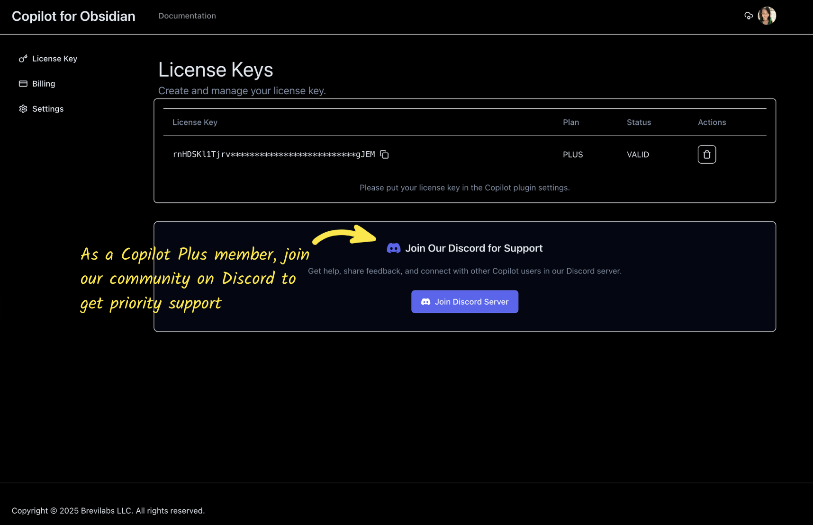

**📖 Get Precision Insights From a Specific Time Window**

**📖 从特定时间窗口获取精确洞察**

- 🧠 **Use When:** You want to quickly review tasks, notes, or ideas from a specific time range without manually digging through files.
- 🧠 **使用场景：** 当您想要快速回顾特定时间范围内的任务、笔记或想法，而无需手动翻阅文件时。

- 💭 **In Chat mode, ask Copilot:**
  > _"Give me a recap of everything I captured last week."_
- 💭 **在聊天模式中，询问Copilot：**
  > _"给我总结一下我上周记录的所有内容。"_

- 💡 **Tip:** Try variations like _"Summarize my highlights from August 11 through August 22"_ for even more insights.
- 💡 **提示：** 尝试如_"总结我从8月11日到8月22日的亮点"_等变体，以获得更多洞察。

  <a href="https://www.youtube.com/watch?v=sXP2sjvrqtI" target="_blank">
    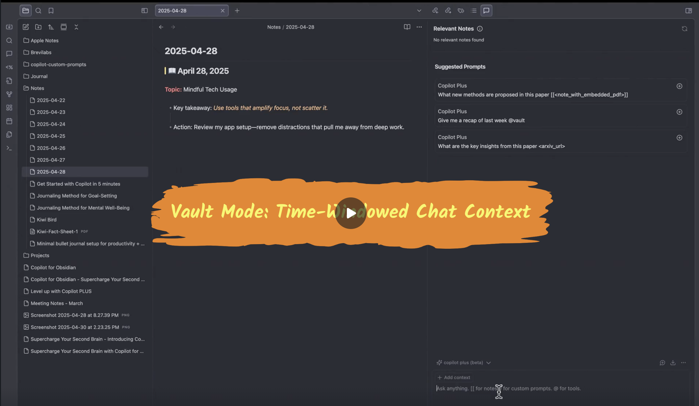
  </a> 
  <em>Click the image to watch the video on YouTube</em>

  <em>点击图片在YouTube上观看视频</em>

**📖 One Prompt, Every Source—Instant Summaries from PDFs, Videos, and Web**

**📖 一个提示，所有来源——从PDF、视频和网络获取即时摘要**

- 🧠 **Use When:** You want to combine information from multiple formats—documents, videos, web pages, and images—into one concise, actionable summary.
- 🧠 **使用场景：** 当您想要将来自多种格式的信息——文档、视频、网页和图像——合并成一个简洁、可操作的摘要时。

- 💭 **In PLUS mode, ask Copilot:**
  > "Please write a short intro of Kiwi birds based on the following information I collected about this animal.
  > @youtube Summarize [https://www.youtube.com/watch?v=tZ2jm_UPc6c&t=417s](https://www.youtube.com/watch?v=ABTfc5wUT1U)
  > in a short paragraph.
  > @websearch where can I find Kiwi birds?
  > Summarize https://www.doc.govt.nz/nature/native-animals/birds/birds-a-z/kiwi/ in 300 words."
- 💭 **在PLUS模式中，询问Copilot：**
  > "请根据我收集的关于这种动物的信息，写一段关于几维鸟的简短介绍。
  > @youtube 请用简短段落总结[https://www.youtube.com/watch?v=tZ2jm_UPc6c&t=417s](https://www.youtube.com/watch?v=ABTfc5wUT1U)。
  > @websearch 在哪里可以找到几维鸟？
  > 请用300字总结https://www.doc.govt.nz/nature/native-animals/birds/birds-a-z/kiwi/。"

- 🛠️ **Add PDFs and Images as Context to Enrich Your Learning**
- 🛠️ **添加PDF和图像作为上下文以丰富您的学习**

- 💡 _Tip: For large PDFs, reference specific sections to focus the AI's attention._
- 💡 _提示：对于大型PDF，引用特定章节以集中AI的注意力。_

  <a href="https://www.youtube.com/watch?v=WXoOZmMSHVE" target="_blank">
    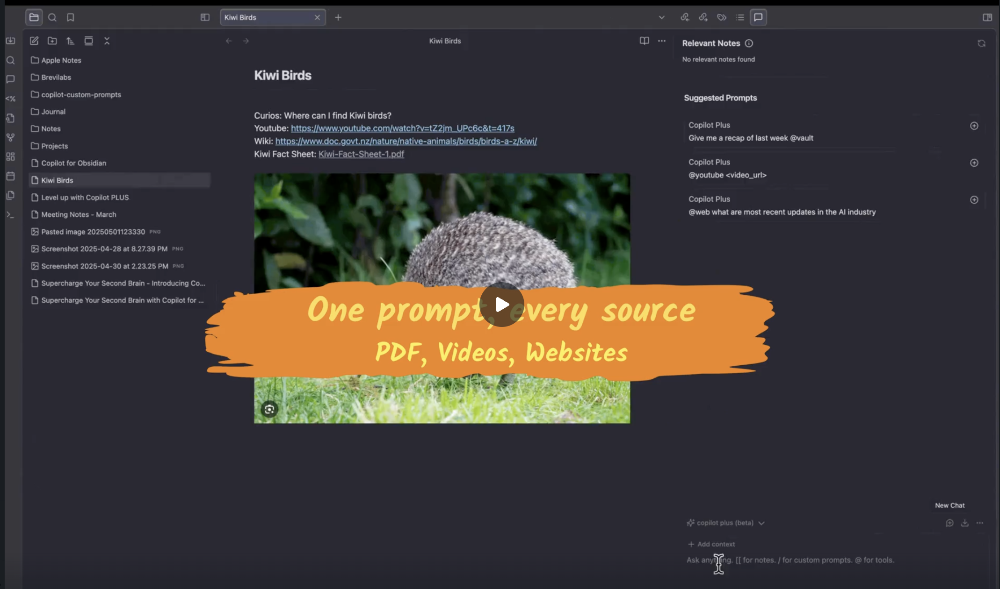
  </a> 
  <em>Click the image to watch the video on YouTube</em>

  <em>点击图片在YouTube上观看视频</em>

## Project Structure 项目结构

The Copilot plugin follows a modular architecture with clearly separated concerns. Here's an overview of the main components:

Copilot插件采用模块化架构，关注点清晰分离。以下是主要组件的概述：

### Core Components 核心组件

- **`main.ts`**: Entry point of the plugin that initializes all components and manages the plugin lifecycle.
- **`main.ts`**: 插件的入口点，初始化所有组件并管理插件生命周期。

- **`chainFactory.ts`**: Implements different chain types (LLM_CHAIN, VAULT_QA_CHAIN, COPILOT_PLUS_CHAIN) for various AI operations.
- **`chainFactory.ts`**: 实现不同链类型（LLM_CHAIN, VAULT_QA_CHAIN, COPILOT_PLUS_CHAIN）以进行各种AI操作。

- **`constants.ts`**: Contains all constants used throughout the plugin, including default settings, command IDs, and API endpoints.
- **`constants.ts`**: 包含插件中使用的所有常量，包括默认设置、命令ID和API端点。

- **`sharedState.ts`**: Manages shared state between different components of the plugin.
- **`sharedState.ts`**: 管理插件不同组件之间的共享状态。

### LLM Providers LLM提供商

Located in `src/LLMProviders/`, this module handles integration with various AI providers:

位于`src/LLMProviders/`中，该模块处理与各种AI提供商的集成：

- **`chatModelManager.ts`**: Manages different chat models from providers like OpenAI, Anthropic, Google, Azure, etc.
- **`chatModelManager.ts`**: 管理来自OpenAI、Anthropic、Google、Azure等提供商的不同聊天模型。

- **`embeddingManager.ts`**: Handles embedding models for semantic search capabilities.
- **`embeddingManager.ts`**: 处理用于语义搜索功能的嵌入模型。

- **`chainManager.ts`**: Coordinates different AI chains and manages their execution.
- **`chainManager.ts`**: 协调不同的AI链并管理其执行。

- **`projectManager.ts`**: Manages projects and their associated contexts.
- **`projectManager.ts`**: 管理项目及其关联的上下文。

- **`brevilabsClient.ts`**: Client for interacting with Brevilabs' backend services (used in Copilot Plus).
- **`brevilabsClient.ts`**: 与Brevilabs后端服务交互的客户端（在Copilot Plus中使用）。

### UI Components UI组件

Located in `src/components/`, this module contains all React components:

位于`src/components/`中，该模块包含所有React组件：

- **`CopilotView.tsx`**: Main view component that hosts the chat interface.
- **`CopilotView.tsx`**: 托管聊天界面的主视图组件。

- **`Chat.tsx`**: Main chat component that handles message display and user interactions.
- **`Chat.tsx`**: 处理消息显示和用户交互的主聊天组件。

- **`chat-components/`**: Contains sub-components for the chat interface like input area, message display, buttons, etc.
- **`chat-components/`**: 包含聊天界面的子组件，如输入区域、消息显示、按钮等。

- **`modals/`**: Various modal dialogs for settings, prompts, and other interactions.
- **`modals/`**: 用于设置、提示和其他交互的各种模态对话框。

- **`ui/`**: Reusable UI components like buttons, inputs, cards, etc.
- **`ui/`**: 可重用的UI组件，如按钮、输入框、卡片等。

### Settings 设置

Located in `src/settings/`, this module handles all plugin configuration:

位于`src/settings/`中，该模块处理所有插件配置：

- **`model.ts`**: Defines the settings model and provides functions for managing settings.
- **`model.ts`**: 定义设置模型并提供管理设置的函数。

- **`v2/`**: Contains the new settings UI with improved organization and user experience.
- **`v2/`**: 包含具有改进组织和用户体验的新设置UI。

- **`providerModels.ts`**: Manages available AI models from different providers.
- **`providerModels.ts`**: 管理来自不同提供商的可用AI模型。

### Search and Indexing 搜索和索引

Located in `src/search/`, this module handles semantic search capabilities:

位于`src/search/`中，该模块处理语义搜索功能：

- **`vectorStoreManager.ts`**: Manages the vector store for semantic search.
- **`vectorStoreManager.ts`**: 管理用于语义搜索的向量存储。

- **`indexOperations.ts`**: Handles indexing operations for the vault.
- **`indexOperations.ts`**: 处理保险库的索引操作。

- **`dbOperations.ts`**: Manages database operations for storing and retrieving embeddings.
- **`dbOperations.ts`**: 管理用于存储和检索嵌入的数据库操作。

- **`hybridRetriever.ts`**: Implements hybrid search combining keyword and semantic search.
- **`hybridRetriever.ts`**: 实现结合关键词和语义搜索的混合搜索。

### Commands 命令

Located in `src/commands/`, this module handles all plugin commands:

位于`src/commands/`中，该模块处理所有插件命令：

- **`index.ts`**: Registers all commands available in the plugin.
- **`index.ts`**: 注册插件中所有可用的命令。

- **`customCommandManager.ts`**: Manages custom user-defined commands.
- **`customCommandManager.ts`**: 管理用户自定义命令。

- **`customCommandRegister.ts`**: Handles registration and execution of custom commands.
- **`customCommandRegister.ts`**: 处理自定义命令的注册和执行。

### Tools 工具

Located in `src/tools/`, this module provides various utility tools:

位于`src/tools/`中，该模块提供各种实用工具：

- **`toolManager.ts`**: Manages available tools and their execution.
- **`toolManager.ts`**: 管理可用工具及其执行。

- **`SearchTools.ts`**: Implements web search capabilities.
- **`SearchTools.ts`**: 实现网络搜索功能。

- **`TimeTools.ts`**: Provides time-related tools and functions.
- **`TimeTools.ts`**: 提供时间相关的工具和函数。

- **`FileTreeTools.ts`**: Handles file tree operations and navigation.
- **`FileTreeTools.ts`**: 处理文件树操作和导航。

### Cache 缓存

Located in `src/cache/`, this module handles various caching mechanisms:

位于`src/cache/`中，该模块处理各种缓存机制：

- **`fileCache.ts`**: Caches file contents for faster access.
- **`fileCache.ts`**: 缓存文件内容以加快访问速度。

- **`pdfCache.ts`**: Caches PDF processing results.
- **`pdfCache.ts`**: 缓存PDF处理结果。

- **`autocompleteCache.ts`**: Caches autocomplete suggestions.
- **`autocompleteCache.ts`**: 缓存自动完成建议。

### Utilities 实用工具

- **`utils.ts`**: General utility functions used throughout the plugin.
- **`utils.ts`**: 在整个插件中使用的通用实用函数。

- **`chatUtils.ts`**: Chat-specific utility functions.
- **`chatUtils.ts`**: 聊天专用实用函数。

- **`noteUtils.ts`**: Note manipulation and processing utilities.
- **`noteUtils.ts`**: 笔记操作和处理实用工具。

## **💡 Need Help?**

## **💡 需要帮助？**

- Check the [documentation](https://www.obsidiancopilot.com/en/docs) for setup guides, how-tos, and advanced features.
- 查看[文档](https://www.obsidiancopilot.com/en/docs)获取设置指南、操作方法和高级功能。

- Watch [Youtube](https://www.youtube.com/@loganhallucinates) for walkthroughs.
- 观看[Youtube](https://www.youtube.com/@loganhallucinates)获取操作指南。

- If you're experiencing a bug or have a feature idea, please follow the steps below to help us help you faster:
- 如果您遇到错误或有功能想法，请按照以下步骤操作，帮助我们更快地为您提供帮助：

  - 🐛 Bug Report Checklist
  - 🐛 错误报告检查清单
    - ☑️Use the [bug report template](https://github.com/logancyang/obsidian-copilot/issues/new?template=bug_report.md) when reporting an issue
    - ☑️报告问题时使用[错误报告模板](https://github.com/logancyang/obsidian-copilot/issues/new?template=bug_report.md)

    - ☑️Enable Debug Mode in Copilot Settings → Advanced for more detailed logs
    - ☑️在Copilot设置→高级中启用调试模式以获取更详细的日志

    - ☑️Open the dev console to collect error messages:
      - Mac: Cmd + Option + I
      - Windows: Ctrl + Shift + I
    - ☑️打开开发控制台收集错误信息：
      - Mac: Cmd + Option + I
      - Windows: Ctrl + Shift + I

    - ☑️Turn off all other plugins, keeping only Copilot enabled
    - ☑️关闭所有其他插件，仅保持Copilot启用

    - ☑️Attach relevant console logs to your report
    - ☑️将相关控制台日志附加到您的报告中

    - ☑️Submit your bug report [here](https://github.com/logancyang/obsidian-copilot/issues/new?template=bug_report.md)
    - ☑️在此处提交您的错误报告[here](https://github.com/logancyang/obsidian-copilot/issues/new?template=bug_report.md)

  - 💡 Feature Request Checklist
  - 💡 功能请求检查清单
    - ☑️Use the [feature request template](https://github.com/logancyang/obsidian-copilot/issues/new?template=feature_request.md) for requesting a new feature
    - ☑️使用[功能请求模板](https://github.com/logancyang/obsidian-copilot/issues/new?template=feature_request.md)请求新功能

    - ☑️Clearly describe the feature, why it matters, and how it would help
    - ☑️清楚地描述功能、为什么重要以及它将如何提供帮助

    - ☑️Submit your feature request [here](https://github.com/logancyang/obsidian-copilot/issues/new?template=feature_request.md)
    - ☑️在此处提交您的功能请求[here](https://github.com/logancyang/obsidian-copilot/issues/new?template=feature_request.md)

# **🙋‍♂️ FAQ**

# **🙋‍♂️ 常见问题**

  
<strong>Why isn’t Vault search finding my notes?</strong>

  
<strong>为什么保险库搜索找不到我的笔记？</strong>

If you're using the Vault QA mode (or the tool <code>@vault</code> in Plus), try the following:

如果您使用的是保险库问答模式（或Plus中的<code>@vault</code>工具），请尝试以下操作：

- Ensure you have a working embedding model from your AI model's provider (e.g. OpenAI). Watch this video: [AI Model Setup (API Key)](https://www.youtube.com/watch?v=mzMbiamzOqM)
- 确保您拥有来自AI模型提供商（如OpenAI）的有效嵌入模型。观看此视频：[AI模型设置（API密钥）](https://www.youtube.com/watch?v=mzMbiamzOqM)

- Ensure your Copilot indexing is up-to-date. Watch this video: [Vault Mode](https://www.youtube.com/watch?v=hBLMWE8WRFU)
- 确保您的Copilot索引是最新的。观看此视频：[保险库模式](https://www.youtube.com/watch?v=hBLMWE8WRFU)

- If issues persist, run <strong>Force Re-Index</strong> or use <strong>List Indexed Files</strong> from the Command Palette to inspect what's included in the index.
- 如果问题仍然存在，请运行<strong>强制重新索引</strong>或使用命令面板中的<strong>列出已索引文件</strong>来检查索引中包含的内容。

- ⚠️ <strong>Don’t switch embedding models after indexing</strong>—it can break the results.
- ⚠️ <strong>索引后不要切换嵌入模型</strong>—这可能会破坏结果。

  
<strong>Why is my AI model returning error code 429: ‘Insufficient Quota’?</strong>

  
<strong>为什么我的AI模型返回错误代码429："配额不足"？</strong>

Most likely this is happening because you haven’t configured billing with your chosen model provider—or you’ve hit your monthly quota. For example, OpenAI typically caps individual accounts at $120/month. To resolve:

最可能的原因是您尚未与所选模型提供商配置计费——或者您已达到月度配额。例如，OpenAI通常将个人账户限制在每月120美元。要解决此问题：

- ▶️ Watch the “AI Model Setup” video: [AI Model Setup (API Key)](https://www.youtube.com/watch?v=mzMbiamzOqM)
- ▶️ 观看"AI模型设置"视频：[AI模型设置（API密钥）](https://www.youtube.com/watch?v=mzMbiamzOqM)

- 🔍 Verify your billing settings in your OpenAI dashboard
- 🔍 在您的OpenAI仪表板中验证您的计费设置

- 💳 Add a payment method if one isn’t already on file
- 💳 如果尚未存档，请添加付款方式

- 📊 Check your usage dashboard for any quota or limit warnings
- 📊 检查您的使用情况仪表板是否有任何配额或限制警告

If you’re using a different provider, please refer to their documentation and billing policies for the equivalent steps.

如果您使用的是其他提供商，请参考他们的文档和计费政策以获取相应的步骤。

  
<strong>Why am I getting a token limit error?</strong>

  
<strong>为什么我收到令牌限制错误？</strong>

Please refer to your model provider’s documentation for the context window size.

请参考您的模型提供商文档了解上下文窗口大小。

⚠️ If you set a large <strong>max token limit</strong> in your Copilot settings, you may encounter this error.

⚠️ 如果您在Copilot设置中设置了较大的<strong>最大令牌限制</strong>，可能会遇到此错误。

- <strong>Max tokens</strong> refers to <em>completion tokens</em>, not input tokens.
- <strong>最大令牌</strong>指的是<em>完成令牌</em>，而不是输入令牌。

- A higher output token limit means less room for input!
- 更高的输出令牌限制意味着输入空间更少！

🧠 Behind-the-scenes prompts for Copilot commands also consume tokens, so:

🧠 Copilot命令的幕后提示也会消耗令牌，因此：

- Keep your message length short
- 保持消息长度简短

- Set a reasonable max token value to avoid hitting the cap
- 设置合理的最大令牌值以避免达到上限

💡 For QA with unlimited context, switch to the <strong>Vault QA</strong> mode in the dropdown (Copilot v2.1.0+ required).

💡 对于具有无限上下文的问答，请在下拉菜单中切换到<strong>保险库问答</strong>模式（需要Copilot v2.1.0+）。

# **💎 Choose the Copilot Plan That’s Right for You**

# **💎 选择适合您的Copilot计划**

| **Feature**                                                        | **Free Plan ✅** | **Plus Plan 💎** | **Believer Plan 🛡️** |
| ------------------------------------------------------------------ | ---------------- | ---------------- | -------------------- |
| No credit card or sign-up required                                 | ✅               | ❌               | ❌                   |
| 无需信用卡或注册                                                   | ✅               | ❌               | ❌                   |
| All open-source features                                           | ✅               | ✅               | ✅                   |
| 所有开源功能                                                       | ✅               | ✅               | ✅                   |
| Bring your own API key                                             | ✅               | ✅               | ✅                   |
| 自带API密钥                                                        | ✅               | ✅               | ✅                   |
| Best-in-class AI chat in Obsidian                                  | ✅               | ✅               | ✅                   |
| Obsidian中一流的AI聊天                                             | ✅               | ✅               | ✅                   |
| Local data store for Vault QA                                      | ✅               | ✅               | ✅                   |
| 保险库问答的本地数据存储                                           | ✅               | ✅               | ✅                   |
| Support                                                            | ✅ Essential     | ✅ Pro           | ✅ Elite             |
| 支持                                                               | ✅ 基础          | ✅ 专业          | ✅ 精英              |
| AI agent capabilities                                              | ❌               | ✅               | ✅                   |
| AI代理功能                                                         | ❌               | ✅               | ✅                   |
| Image and PDF support                                              | ❌               | ✅               | ✅                   |
| 图像和PDF支持                                                      | ❌               | ✅               | ✅                   |
| Enhanced chat UI (context menu)                                    | ❌               | ✅               | ✅                   |
| 增强聊天UI（上下文菜单）                                           | ❌               | ✅               | ✅                   |
| State-of-the-art embedding models included                         | ❌               | ✅               | ✅                   |
| 包含最先进的嵌入模型                                               | ❌               | ✅               | ✅                   |
| Exclusive @AI tools (e.g., web, YouTube)                           | ❌               | ✅               | ✅                   |
| 独家@AI工具（如网络、YouTube）                                     | ❌               | ✅               | ✅                   |
| Exclusive chat model included in plan                              | ❌               | ✅               | ✅                   |
| 计划中包含独家聊天模型                                             | ❌               | ✅               | ✅                   |
| Access to exclusive Discord channel                                | ❌               | ✅               | ✅                   |
| 访问独家Discord频道                                                | ❌               | ✅               | ✅                   |
| Lifetime access                                                    | ❌               | ❌               | ✅                   |
| 终身访问                                                           | ❌               | ❌               | ✅                   |
| Priority access to new features                                    | ❌               | ❌               | ✅                   |
| 优先访问新功能                                                     | ❌               | ❌               | ✅                   |
| Prioritized feature requests                                       | ❌               | ❌               | ✅                   |
| 优先功能请求                                                       | ❌               | ❌               | ✅                   |
| Exclusive access to next-gen chat & embedding models (coming soon) | ❌               | ❌               | ✅                   |
| 独家访问下一代聊天和嵌入模型（即将推出）                           | ❌               | ❌               | ✅                   |

## **🙏 Thank You**

## **🙏 感谢您**

If you share the vision of building the most powerful AI agent for our second brain, consider [sponsoring this project](https://github.com/sponsors/logancyang) or buying me a coffee. Help spread the word by sharing Copilot for Obsidian on Twitter/X, Reddit, or your favorite platform!

如果您认同为我们的第二大脑构建最强大的AI代理的愿景，请考虑[赞助此项目](https://github.com/sponsors/logancyang)或给我买杯咖啡。通过在Twitter/X、Reddit或您喜欢的平台上分享Obsidian的Copilot来帮助传播这个消息！

  

**Acknowledgments**

**致谢**

Special thanks to our top sponsors: @mikelaaron, @pedramamini, @Arlorean, @dashinja, @azagore, @MTGMAD, @gpythomas, @emaynard, @scmarinelli, @borthwick, @adamhill, @gluecode, @rusi, @timgrote, @JiaruiYu-Consilium, @ddocta, @AMOz1, @chchwy, @pborenstein, @GitTom, @kazukgw, @mjluser1, @joesfer, @rwaal, @turnoutnow-harpreet, @dreznicek, @xrise-informatik, @jeremygentles, @ZhengRui, @bfoujols, @jsmith0475, @pagiaddlemon, @sebbyyyywebbyyy, @royschwartz2, @vikram11, @amiable-dev, @khalidhalim, @DrJsPBs, @chishaku, @Andrea18500, @shayonpal, @rhm2k, @snorcup, @JohnBub, @obstinatelark, @jonashaefele, @vishnu2kmohan

特别感谢我们的顶级赞助商：@mikelaaron, @pedramamini, @Arlorean, @dashinja, @azagore, @MTGMAD, @gpythomas, @emaynard, @scmarinelli, @borthwick, @adamhill, @gluecode, @rusi, @timgrote, @JiaruiYu-Consilium, @ddocta, @AMOz1, @chchwy, @pborenstein, @GitTom, @kazukgw, @mjluser1, @joesfer, @rwaal, @turnoutnow-harpreet, @dreznicek, @xrise-informatik, @jeremygentles, @ZhengRui, @bfoujols, @jsmith0475, @pagiaddlemon, @sebbyyyywebbyyy, @royschwartz2, @vikram11, @amiable-dev, @khalidhalim, @DrJsPBs, @chishaku, @Andrea18500, @shayonpal, @rhm2k, @snorcup, @JohnBub, @obstinatelark, @jonashaefele, @vishnu2kmohan

## **Copilot Plus Disclosure**

## **Copilot Plus声明**

Copilot Plus is a premium product of Brevilabs LLC and it is not affiliated with Obsidian. It offers a powerful agentic AI integration into Obsidian. Please check out our website [obsidiancopilot.com](https://obsidiancopilot.com/) for more details!

Copilot Plus是Brevilabs LLC的高级产品，与Obsidian无关。它提供了强大的AI代理集成到Obsidian中。请查看我们的网站[obsidiancopilot.com](https://obsidiancopilot.com/)了解更多详情！

- An account and payment are required for full access.
- 完整访问需要账户和付款。

- Copilot Plus requires network use to faciliate the AI agent.
- Copilot Plus需要网络使用来促进AI代理。

- Copilot Plus does not access your files without your consent.
- Copilot Plus未经您同意不会访问您的文件。

- Copilot Plus collect server-side telemetry to improve the product. Please see the privacy policy on the website for more details.
- Copilot Plus收集服务器端遥测数据以改进产品。请在网站上查看隐私政策了解更多详情。

- The frontend code of Copilot plugin is fully open-source. However, the backend code facilitating the AI agents is close-sourced and proprietary.
- Copilot插件的前端代码完全开源。但是，促进AI代理的后端代码是闭源和专有的。

- We offer a full refund if you are not satisfied with the product within 14 days of your purchase, no questions asked.
- 如果您在购买后14天内对产品不满意，我们提供全额退款，无需询问。

## **Authors**

## **作者**

Brevilabs Team | Email: logan@brevilabs.com | X/Twitter: [@logancyang](https://twitter.com/logancyang)

Brevilabs团队 | 邮箱：logan@brevilabs.com | X/Twitter：[@logancyang](https://twitter.com/logancyang)